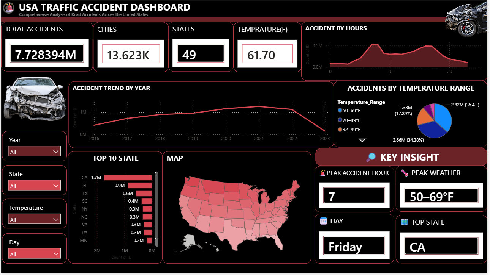

# 🚨 USA Traffic Accident Dashboard

An interactive Power BI dashboard analyzing road accidents across the United States.

## 📊 Dashboard Features

- Total Accidents
- Total Cities
- Total States
- Average Temperature
- Accident Trend by Year
- Accidents by Temperature Range
- Top 10 States
- USA Accident Map
- Accidents by Hour
- Key Insights
- Year, State, Temperature and Day filters

## 🔍 Key Insights

- Peak accident hour: 7 AM
- Peak temperature range: 50–69°F
- Peak accident day: Friday
- Highest accident state: California

## 📌 Project Overview

This project analyzes traffic accident data across the United States to identify accident patterns, trends, weather conditions, peak hours, and states with the highest number of accidents.

The project combines **Python for data analysis and preprocessing** with **Power BI for interactive data visualization and dashboard development**.

## 🎯 Project Objectives

- Analyze the overall number of traffic accidents
- Identify accident trends over the years
- Find peak accident hours
- Analyze accidents by temperature range
- Identify states with the highest number of accidents
- Analyze accident patterns by day
- Visualize accident locations across the USA
- Build an interactive Power BI dashboard

## 🛠️ Tools & Technologies

- Python
- Pandas
- NumPy
- Matplotlib
- Jupyter Notebook
- Power BI
- DAX

## 📂 Project Structure

USA_Traffic_Accident_Analysis/
│
├── README.md
│
├── powerbi/
│   └── USA_Traffic_Accident_Dashboard.pbix
│
├── notebooks/
│   └── Traffic_Accident_Analysis.ipynb
│
├── data/
│   └── processed/
│       ├── temperature_summary.csv
│       ├── day_type_summary.csv
│       ├── time_period_summary.csv
│       ├── city_summary.csv
│       ├── state_summary.csv
│       ├── hour_summary.csv
│       ├── day_summary.csv
│       └── year_summary.csv
│
└── images/
    └── dashboard_ss.png

## 📸 Dashboard Preview

## 📊 Power BI Dashboard

[Download Power BI Dashboard](https://github.com/krishnayadav5035-beep/USA-Traffic-Accident-PowerBI-Dashboard/releases/tag/v1.0)
